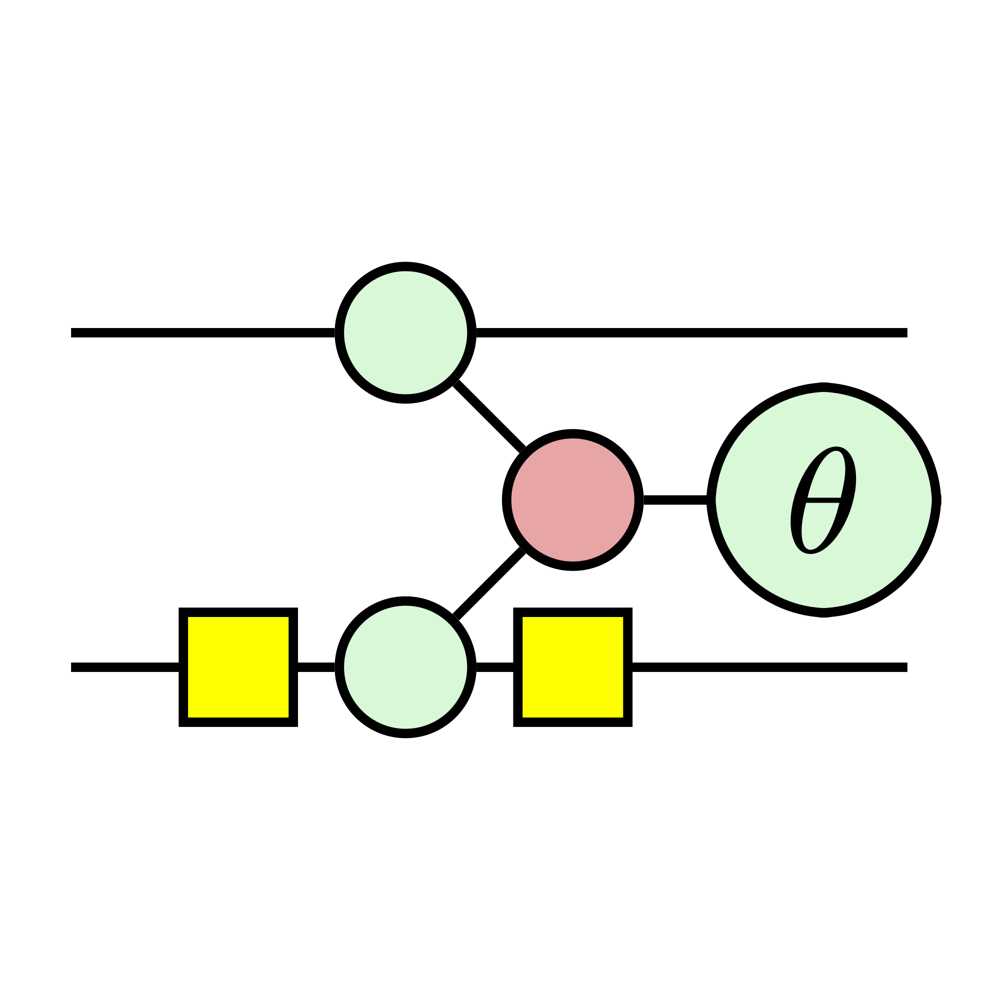

# ZxFermion


## Contents
- [1) What is ZxFermion?](#what-is-zxfermion?)
- [2) Getting Started](#getting-started)
  - [Creating Pauli Gadgets](#creating-pauli-gadgets)
  - [Creating Circuits of Gadgets](#creating-circuits-of-gadgets)
  - [Working with Cliffords](#working-with-cliffords)
- [3) Documentation](#documentation)
  - [BaseGraph](#basegraph-class)

## What is ZxFermion?
ZxFermion is a Python package built on top of [PyZX](https://pyzx.readthedocs.io/en/latest/) designed for the manipulation and visualisation of circuits of Pauli gadgets. With built-in Clifford tableau logic using [Stim](https://github.com/quantumlib/Stim), ZxFermion allows users to quickly implement proofs and test ideas.

VQE algorithms used in quantum chemistry often utilise the [UCC](https://doi.org/10.48550/arXiv.2109.15176) framework in which excitation operators have a natural representation as Pauli gadgets. ZxFermion provides a comprehensive toolset designed to be using in a Jupyter notebook environment. Export functionality can be used to generated research paper quality diagrams.

All of the following diagrams were made using ZxFermion.

## Getting Started

### Creating Pauli gadgets
To begin... Then to export to pdf, run `gadget.pdf('file_name')`.

```python
from zxfermion import Gadget
gadget = Gadget('YZX', as_gadget=False)
gadget.graph.draw()
```


By default gadgets are represented in the following more compact form.
```python
gadget = Gadget('YZX', phase=1/2, as_gadget=True)
gadget.draw()
```

### Creating circuits of gadgets

### Working with Cliffords

## Documentation

#### `BaseGraph` class
The `BaseGraph` class extends the PyZX `GraphS` class. It implements a number of useful methods and properties handling ZX diagrams.

##### _property_ `min_qubit`
Returns the minimum qubit of the current graph.

Return type: `int`

##### _property_ `max_qubit`
Returns the maximum qubit of the current graph.

Return type: `int`

##### _property_ `input_row`
Returns the input row index of the current graph.

Return type: `int`

##### _property_ `output_row`
Returns the output row index of the current graph.

Return type: `int | float`

##### _property_ `left_row`
Returns the leftmost row index of the current graph

Return type: `int | float`

##### _property_ `right_row`
Returns the rightmost row index of the current graph

Return type: `int | float`

##### _property_ `left_padding`
Returns the left padding (separation between `BaseGraph.input_row` and `BaseGraph.left_row`) of the current graph.

Return type: `int | float`

##### _property_ `right_padding`
Returns the right padding (separation between `BaseGraph.output_row` and `BaseGraph.right_row`) of the current graph.

Return type: `int | float`

##### _property_ `boundaries`
Returns the combined vertex indices of the inputs and outputs of the current graph.

Return type: `list[int]`

##### _property_ `graph_rows`
Returns the row indices of the current graph (from `BaseGraph.left_row` to `BaseGraph.right_row` inclusive).

Return type: `list[int]`

##### _property_ `graph_depth`
Returns the depth of the current graph from `BaseGraph.input_row` to `BaseGraph.output_row` (excluding vertices outside of graph bounds).

Return type: `int | float`

##### _method_ `left_end(qubit: int)`

##### _method_ `right_end(qubit: int)`

##### _method_ `left_row_within(top: int, bottom: int)`

##### _method_ `right_row_within(top: int, bottom: int)`

##### _property_ `bounded_vertices`

##### _property_ `unbounded_vertices`

##### `vertices_on_qubit(qubit: int)` method

##### _method_ `remove_wire(qubit: int)`

##### _method_ `connect_vertices(vertices: list[int])`

##### _method_ `set_input_row(row: int)`

##### _method_ `set_output_row(row: int)`

##### _method_ `set_left_padding(padding: int)`

##### _method_ `set_right_padding(padding: int)`

##### _method_ `set_num_qubits(num_qubits: int)`

##### _method_ `update_num_qubits(num_qubits: int)`

##### _method_ `compose(other: BaseGraph, stack: bool = False)`

##### _method_ `matrix(return_latex: bool = False, override_max: bool = False)`

##### _method_ `tikz(name: Optional[str] = None, scale: float = 0.5)`

##### _method_ `tex(name: Optional[str] = None, scale: float = 0.5)`

##### _method_ `pdf(name: Optional[str] = None, scale: float = 0.5)`

##### _method_ `draw(labels: bool = False)`

##### _method_ `qubits()`
Inherits from PyZX `GraphS` class. See [PyZX documentation](https://pyzx.readthedocs.io/en/latest/api.html#pyzx.graph.base.BaseGraph).

##### _method_ `rows()`
Inherits from PyZX `GraphS` class. See [PyZX documentation](https://pyzx.readthedocs.io/en/latest/api.html#pyzx.graph.base.BaseGraph).

##### _method_ `inputs()`
Inherits from PyZX `GraphS` class. See [PyZX documentation](https://pyzx.readthedocs.io/en/latest/api.html#pyzx.graph.base.BaseGraph).

##### _method_ `outputs()`
Inherits from PyZX `GraphS` class. See [PyZX documentation](https://pyzx.readthedocs.io/en/latest/api.html#pyzx.graph.base.BaseGraph).

##### _method_ `qubits()`
Inherits from PyZX `GraphS` class. See [PyZX documentation](https://pyzx.readthedocs.io/en/latest/api.html#pyzx.graph.base.BaseGraph).

##### _method_ `num_inputs()`
Inherits from PyZX `GraphS` class. See [PyZX documentation](https://pyzx.readthedocs.io/en/latest/api.html#pyzx.graph.base.BaseGraph).

##### _method_ `num_outsputs()`
Inherits from PyZX `GraphS` class. See [PyZX documentation](https://pyzx.readthedocs.io/en/latest/api.html#pyzx.graph.base.BaseGraph).

##### _method_ `num_vertices()`
Inherits from PyZX `GraphS` class. See [PyZX documentation](https://pyzx.readthedocs.io/en/latest/api.html#pyzx.graph.base.BaseGraph).

##### _method_ `num_edges()`
Inherits from PyZX `GraphS` class. See [PyZX documentation](https://pyzx.readthedocs.io/en/latest/api.html#pyzx.graph.base.BaseGraph).

##### _method_ `set_inputs()`
Inherits from PyZX `GraphS` class. See [PyZX documentation](https://pyzx.readthedocs.io/en/latest/api.html#pyzx.graph.base.BaseGraph).

##### _method_ `set_outputs()`
Inherits from PyZX `GraphS` class. See [PyZX documentation](https://pyzx.readthedocs.io/en/latest/api.html#pyzx.graph.base.BaseGraph).

##### _method_ `add_vertex()`
Inherits from PyZX `GraphS` class. See [PyZX documentation](https://pyzx.readthedocs.io/en/latest/api.html#pyzx.graph.base.BaseGraph).

##### _method_ `add_edge()`
Inherits from PyZX `GraphS` class. See [PyZX documentation](https://pyzx.readthedocs.io/en/latest/api.html#pyzx.graph.base.BaseGraph).

##### _method_ `row()`
Inherits from PyZX `GraphS` class. See [PyZX documentation](https://pyzx.readthedocs.io/en/latest/api.html#pyzx.graph.base.BaseGraph).

##### _method_ `qubit()`
Inherits from PyZX `GraphS` class. See [PyZX documentation](https://pyzx.readthedocs.io/en/latest/api.html#pyzx.graph.base.BaseGraph).

##### _method_ `type()`
Inherits from PyZX `GraphS` class. See [PyZX documentation](https://pyzx.readthedocs.io/en/latest/api.html#pyzx.graph.base.BaseGraph).

##### _method_ `phase()`
Inherits from PyZX `GraphS` class. See [PyZX documentation](https://pyzx.readthedocs.io/en/latest/api.html#pyzx.graph.base.BaseGraph).

##### _method_ `connected()`
Inherits from PyZX `GraphS` class. See [PyZX documentation](https://pyzx.readthedocs.io/en/latest/api.html#pyzx.graph.base.BaseGraph).

##### _method_ `remove_vertex()`
Inherits from PyZX `GraphS` class. See [PyZX documentation](https://pyzx.readthedocs.io/en/latest/api.html#pyzx.graph.base.BaseGraph).

##### _method_ `remove_edge()`
Inherits from PyZX `GraphS` class. See [PyZX documentation](https://pyzx.readthedocs.io/en/latest/api.html#pyzx.graph.base.BaseGraph).

### GadgetGraph

### Gadget

### GadgetCircuit

### Paulis

### Cliffords

##### CX & CZ

##### Hadamard