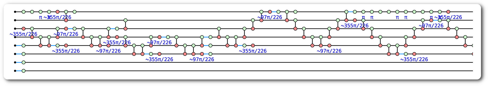
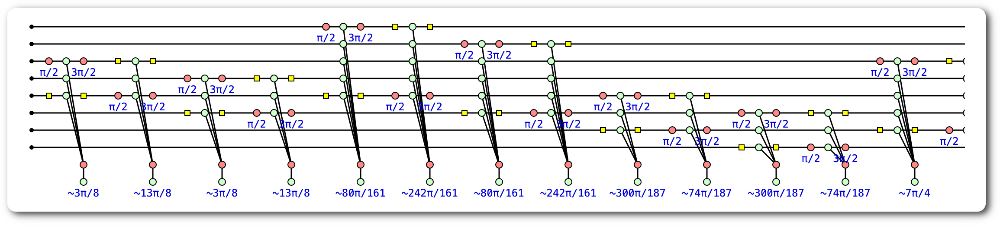

# ZXFermion

## Introduction

### DISCO-VQE Algorithm Overview
- The DISCO-VQE algorithm attemps to prepare the ansatz for the ground state of some system by finding the sequence of parametrised unitaries such that
$$\ket\psi = U_{(\vec\theta)} \ket{\psi_0}$$
$$\text{Where } U_{\vec\theta} = U_{\theta_{1}} U_{\theta_{2}}\dots$$
- Where $\ket{\psi_0}$ is some reference state
- It does so by selecting a number of spin-preserving fermionic excitation operators from an operator pool, each parametrised by $\theta_i$, then applies them in a given sequence to the reference state
- The resulting ansatz for the ground state is some linear combination of excited states of the system that account for the Coulomb correlation present in the system
- The energy expectation value of the resultant state $\psi$ is then evaluated on a quantum circuit by taking many 'shots' (measurements) and taking the mean of measurement outcomes
- The basin-hopping algorithm then uses the computed expectation value and the gradients of each unitary (with respect to parameter $\theta_i$) to determine the next 'informed' guess for the ground state
- Both continuous and discrete variables are optimised during the optimisation and the process above repeated until the energy expectation value converges to some minimum which must approach the true ground state energy from above according to the Rayleigh Ritz principle
  - Continuous parameter $\theta_i$ is optimised for each exponentiated excitation term
  - The ground state preparation unitary is also discretely optimised in that the fermionic excitation operators selected vary as well as their order

### Fermionic Excitation Operators
- The fermionic excitation operators in the pool are selected from all possible single and double excitation operators for a given quantum system
- The terms are mapped to qubits using the Jordan Wigner transformation such that each fermionic excitation operator now represents some sequence of Pauli operators (Pauli string)
- Since any unitary can be expressed as the exponential of an anti-Hermitian matrix, it follows that we can construct the excitation terms by prepending a phase $\theta_i$ and exponentiating the resulting terms
$$U_{(\theta)} = e^{\theta\hat A} \quad\text{ where $\hat A$ is anti-Hermitian}$$
- The total state-preparation unitary is then the ordered product of all selected exponential excitation terms for a given iteration of the DISCO-VQE algorithm

## Example Circuit

## Example Phase Gadget

$$\ket\psi = U_{(\vec\theta)} \ket{\psi_0}$$