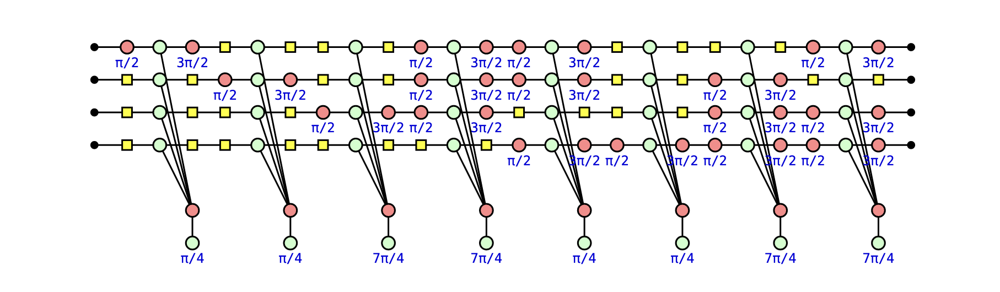
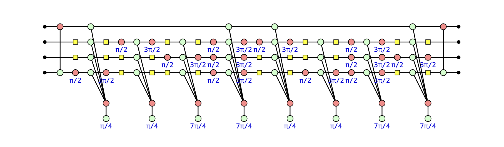
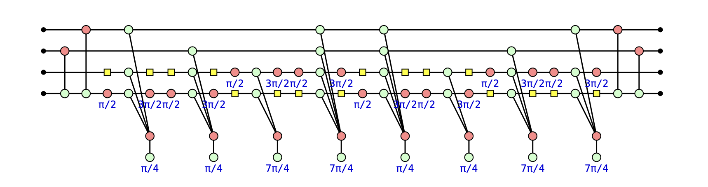
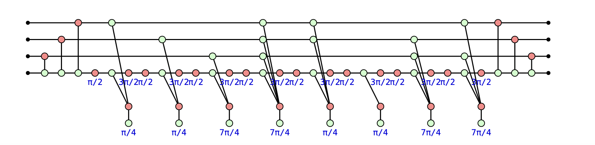

# ZxFermion

## Motivation
ZxFermion is a Python package for manipulating Pauli gadgets. It's intended purpose is to facilitate derivations and proofs relating to circuits of Pauli gadgets.

Within the Unitary Coupled Cluster (UCC) and Variational Quantum Eigensolver (VQE) frameworks, molecules are simulated by constructing ansätze consisting of a sequence of fermionic excitation operators to account for electronic correlation. Generally, fermionic excitation operators are cast to quantum circuits as Pauli gadgets following exponentiation and the Jordan-Wigner transformation. Hence, ZxFermion serves as a tool to researchers for reasoning about the ansätze of molecules.

The `Gadget` and `GadgetCircuit` classes represent single Pauli gadgets and circuits of Pauli gadgets respectively. Each class comes equipped with methods describing the action of the members of the Pauli and Clifford groups on Pauli gadgets.

## Usage

### Decomposition of Double Fermionic Excitation to Triply Controlled Rotations 
```python
circuit = GadgetCircuit(num_qubits=4, gadgets=[
    Gadget('YXXX', phase=1/4),
    Gadget('XYXX', phase=1/4),
    Gadget('XXYX', phase=-1/4),
    Gadget('YYYX', phase=-1/4),
    Gadget('YYXY', phase=1/4),
    Gadget('XXXY', phase=1/4),
    Gadget('XYYY', phase=-1/4),
    Gadget('YXYY', phase=-1/4),
])

circuit.draw()
circuit.surround_cx(control=3, target=0)
circuit.surround_cx(control=3, target=1)
circuit.surround_cx(control=3, target=2)
```







### Other Examples
See [Jupyter Notebook](notebook.ipynb)
