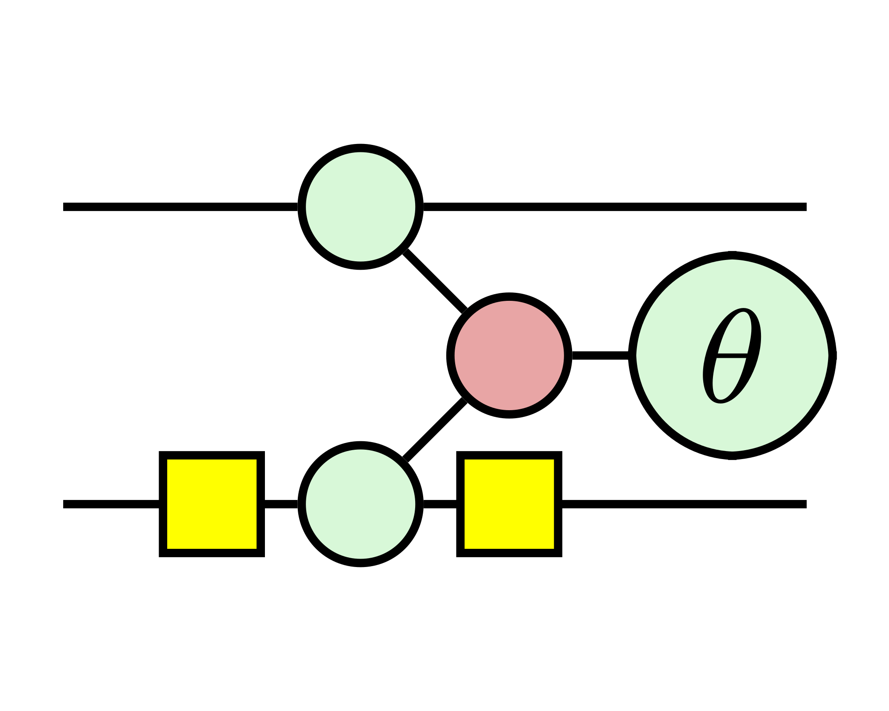
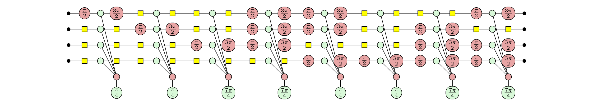

# ZxFermion
[](https://docs.python.org/3.9/)



## Contents
- [What is ZxFermion?](#what-is-zxfermion?)
- [2) Getting Started](#getting-started)
  - [Creating Pauli Gadgets](#creating-pauli-gadgets)
  - [Creating Circuits of Gadgets](#creating-circuits-of-pauli-gadgets)
  - [Analysis of Quantum Stabiliser Circuits](#analysis-of-quantum-stabiliser-circuits)
- [3) Documentation](#documentation)
  - [Gates](#gates)
  - [Circuits](#circuits)
  - [Graphs](#graphs)
    - [Tableau](#tableaus)

## What is ZxFermion?
ZxFermion is a Python package built on top of [PyZX](https://pyzx.readthedocs.io/en/latest/) designed for the manipulation and visualisation of circuits of Pauli gadgets. With built-in Clifford tableau logic using [Stim](https://github.com/quantumlib/Stim), ZxFermion allows users to quickly implement proofs and test ideas.

VQE algorithms used in quantum chemistry often utilise the [UCC](https://doi.org/10.48550/arXiv.2109.15176) framework in which excitation operators have a natural representation as Pauli gadgets. ZxFermion provides a comprehensive toolset designed to be used in a Jupyter notebook environment. Export functionality can be used to generated research paper quality diagrams.

## Getting Started
All of the following diagrams were made using ZxFermion's `pdf(name='filename')` method.

### Import Relevant Modules
```python
from zxfermion import Gadget, GadgetCircuit
from zxfermion.gates import XPhase, ZPhase, CX, CZ, X, Z
```

### Creating Pauli gadgets
We begin by introducing the `Gadget` class, which we use to represent Pauli gadgets. The `Gadget` class takes a Pauli string and a phase as inputs. By default, Pauli gadgets are represented in their form in the ZX calculus.
```python
gadget = Gadget('YZX', phase=1/2)
gadget.draw()
```


Setting `as_gadget=False` allows users to visualise Pauli gadgets in their expanded form. 
```python
gadget = Gadget('YZX', phase=1/2, as_gadget=False)
gadget.draw()
```


### Creating circuits of Pauli gadgets
We can construct circuits of Pauli gadgets using the `GadgetCircuit` class by passing an ordered list of `Gadget` instances to the `gates` parameter. The `variable` parameter allows users to specify the LaTeX symbol used to render each Pauli gadget's phase when exporting to PDF.
```python
gadget1 = Gadget('YZX', phase=1/2, variable='theta')
gadget2 = Gadget('XZY', phase=1/2, variable='phi')
circuit = GadgetCircuit(gates=[gadget1, gadget2])
circuit.draw()
```


The `GadgetCircuit` class also allows users to represent circuits of standard quantum gates.
```python
circuit = GadgetCircuit([CX(0, 1), CZ(1, 2), X(1), ZPhase(0, 3/4), XPhase(0, 1/2), CX(0, 2), CX(0, 1), CZ(1, 2)])
circuit.draw(stack=True)
```


### Analysis of Quantum Stabiliser Circuits
Using [Stim](https://github.com/quantumlib/Stim) as a backend, users can easily observe the effect of Pauli and Clifford gates on Pauli gadgets. Consider the following circuit of Pauli gadgets, which represents a paired double excitation operator.
```python
circuit = GadgetCircuit([
    Gadget('YXXX', phase=1/4),
    Gadget('XYXX', phase=1/4),
    Gadget('XXYX', phase=-1/4),
    Gadget('YYYX', phase=-1/4),
    Gadget('YYXY', phase=1/4),
    Gadget('XXXY', phase=1/4),
    Gadget('XYYY', phase=-1/4),
    Gadget('YXYY', phase=-1/4)
])
circuit.draw()
```


It is easy to show the effect of conjugating the circuit by CNOT gates.
```python
circuit.apply(CX(0, 3), draw=True)
circuit.apply(CX(0, 2), draw=True)
circuit.apply(CX(0, 1), draw=True)
circuit.draw()
```


## Documentation

### Gates
Setting `as_gadget=True` allows users to visualise any of the standard quantum gates as Pauli gadgets.

#### _class_ `CX(control: int, target: int, as_gadget=False)`
- Class for representing the CX gate.

#### _class_ `CZ(control: int, target: int, as_gadget=False)`
- Class for representing the CZ gate.

#### _class_ `X(qubit: int, as_gadget=False)`
- Class for representing the X gate.

#### _class_ `Z(qubit: int, as_gadget=False)`
- Class for representing the Z gate.

#### _class_ `XPhase(qubit: int, phase=None, as_gadget=False)`
- Class for representing a general rotation gate in the X basis.

#### _class_ `ZPhase(qubit: int, phase=None, as_gadget=False)`
- Class for representing a general rotation gate in the Z basis.

#### _class_ `XPlus(qubit: int, as_gadget=False)`
- Class for representing a $\pi/2$ rotation in the X basis.

#### _class_ `ZPlus(qubit: int, as_gadget=False)`
- Class for representing a $\pi/2$ rotation in the Z basis.

#### _class_ `XMinus(qubit: int, as_gadget=False)`
- Class for representing a $3\pi/2$ rotation in the X basis.

#### _class_ `ZPlus(qubit: int, as_gadget=False)`
- Class for representing a $3\pi/2$ rotation in the Z basis.

#### _class_ `Gadget(pauli_string: str, phase: int | float, as_gadget=True)`
- Class for representing Pauli gadgets.
- Setting `as_gadget=True` allows users to represent the gadget in its simplified form. 
- Setting `as_gadget=False` allows users to represent the gadget as a CNOT ladder construction.


### Circuits
#### _class_ `GadgetCircuit(num_qubits: int, gates: list`
- Class for representing circuits of Pauli gadgets and other quantum gates.
- The gates parameter takes a list of `Gadget`, `X`, `Z`, `CX`...

##### _method_ `apply(gate, start: int, end: int)`
- Return type: `None`

##### _method_ `graph(as_gadgets=None, stack=False)`
- Return type: `GadgetGraph`

##### _method_ `draw(as_gadgets=None, stack=False, labels=False)`
- Return type: `None`

##### _method_ `tikz(name: str, scale: float, as_gadgets=None, stack=False)`
- Return type: `str | None`

##### _method_ `pdf(name: str, scale: float, as_gadgets=None, stack=False)`
- Return type: `None`

##### _method_ `to_dict()`
- Return type: `None`

##### _staticmethod_ `from_dict(circuit_dict: dict)`
- Return type: `GadgetCircuit`

##### _method_ `matrix(return_latex=False)`
- Return type: `str | None`

### Graphs
#### _class_ `GadgetGraph`
- Inherits from the `zxfermion.BaseGraph` class (see above).
- Implements methods for handling the graphing of the `Gadget` class and other quantum gates.

##### _method_ `add(gate)`
- Return type: `None`

##### _method_ `add_cx(cx: CX)`
- Return type: `None`

##### _method_ `add_cz(cz: CZ)`
- Return type: `None`

##### _method_ `add_cx_gadget(cx: CX)`
- Return type: `None`

##### _method_ `add_cz_gadget(cz: CZ)`
- Return type: `None`

##### _method_ `add_gadget(gadget: Gadget)`
- Return type: `None`

##### _method_ `add_expanded_gadget(gadget: Gadget)`
- Return type: `None`

#### _class_ `BaseGraph`
- Extends the `pyzx.GraphS` class. Implements a number of additional methods for handling ZX diagrams.
- Please see the [PyZX documentation](https://pyzx.readthedocs.io/en/latest/api.html#pyzx.graph.base.BaseGraph).

##### _property_ `min_qubit`
- Returns the minimum qubit of the current graph.
- Return type: `int`

##### _property_ `max_qubit`
- Returns the maximum qubit of the current graph.
- Return type: `int`

##### _property_ `input_row`
- Returns the input row index of the current graph.
- Return type: `int | float`

##### _property_ `output_row`
- Returns the output row index of the current graph.
- Return type: `int | float`

##### _property_ `left_row`
- Returns the leftmost row index of the current graph
- Return type: `int | float`

##### _property_ `right_row`
- Returns the rightmost row index of the current graph
- Return type: `int | float`

##### _property_ `left_padding`
- Returns the left padding (separation between `input_row` and `left_row`) of the current graph.
- Return type: `int | float`

##### _property_ `right_padding`
- Returns the right padding (separation between `output_row` and `right_row`) of the current graph.
- Return type: `int | float`

##### _property_ `boundaries`
- Returns the combined vertex indices of the inputs and outputs of the current graph.
- Return type: `list[int]`

##### _property_ `graph_rows`
- Returns the row indices of the current graph (from `left_row` to `right_row` inclusive).
- Return type: `list[int | float]`

##### _property_ `graph_depth`
- Returns the depth of the current graph from `input_row` to `output_row`.
- Excludes vertices outside of graph bounds.
- Return type: `int | float`

##### _method_ `left_end(qubit: int)`
- Returns the leftmost row index of the graph along the specified qubit.
- Return type: `int | float`

##### _method_ `right_end(qubit: int)`
- Returns the rightmost row index of the graph along the specified qubit.
- Return type: `int | float`

##### _method_ `left_row_within(top: int, bottom: int)`
- Returns the leftmost row index of the graph between the specified qubits.
- Return type: `int | float`

##### _method_ `right_row_within(top: int, bottom: int)`
- Returns the rightmost row index of the graph between the specified qubits.
- Return type: `int | float`

##### _property_ `bounded_vertices`
- Returns the vertex indices of the graph excluding vertices positioned outside the graph bounds.
- Excludes input and outputs vertices.
- Return type: `list[int]`

##### _property_ `unbounded_vertices`
- Returns the vertex indices of the graph positioned outside the graph bounds.
- Excludes input and outputs vertices.
- Return type: `list[int]`

##### _method_ `vertices_on_qubit(qubit: int)`
- Return the vertex indices along the specified qubit and excluding the input and output vertices.
- Return type: `list[int]`

##### _method_ `remove_wire(qubit: int)`
- Removes the edge connecting the input and output vertices for the specified qubit.
- Return type: `None`

##### _method_ `connect_vertices(vertices: list[int])`
- Creates simple edges between the specified vertex indices.
- Return type: `None`

##### _method_ `set_input_row(row: int)`
- Positions the input row at the specified row index.
- Return type: `None`

##### _method_ `set_output_row(row: int)`
- Positions the output row at the specified row index.
- Return type: `None`

##### _method_ `set_left_padding(padding: int)`
- Sets the left padding (separation between input row and left row) of the graph.
- Return type: `None`

##### _method_ `set_right_padding(padding: int)`
- Sets the right padding (separation between output row and right row) of the graph.
- Return type: `None`

##### _method_ `set_num_qubits(num_qubits: int)`
- Sets the number of qubits for the graph.
- Maintains first `2 * num_qubits` vertex indices as the input and output indices.
- Return type: `None`

##### _method_ `update_num_qubits(num_qubits: int)`
- Sets the number of qubits for the graph if `num_qubits` is greater than the current number of qubits. 
- Return type: `None`

##### _method_ `compose(other: BaseGraph, stack: bool = False)`
- Overrides the `pyzx.GraphS.compose()` to allow addition of graphs of different dimension.
- Setting `stack` parameter as `True` will stack graphs acting on disjoint set of qubits. 
- Return type: `None`

##### _method_ `matrix(return_latex: bool = False, override_max: bool = False)`
- Displays a latex matrix for the current gate, `Gadget` or `GadgetCircuit`.
- Return type: `str | None`

##### _method_ `tikz(name: Optional[str] = None, scale: float = 0.5)`
- Generates a tikz file for the current gate, `Gadget` or `GadgetCircuit`.
- Return type: `str | None`

##### _method_ `tex(name: Optional[str] = None, scale: float = 0.5)`
- Generates a tex file for the current gate, `Gadget` or `GadgetCircuit`.
- Return type: `None`

##### _method_ `pdf(name: Optional[str] = None, scale: float = 0.5)`
- Generates a pdf file for the current gate, `Gadget` or `GadgetCircuit`.
- Return type: `None`

##### _method_ `draw(labels: bool = False)`
- Draws the current gate, `Gadget` or `GadgetCircuit`.
- Return type: `None`

### Tableaus
#### _class_ `Tableau`
- Class for handling the interaction of the `Gadget` class with the Pauli and Clifford gates.
- Built on top of [Stim](https://github.com/quantumlib/Stim).

